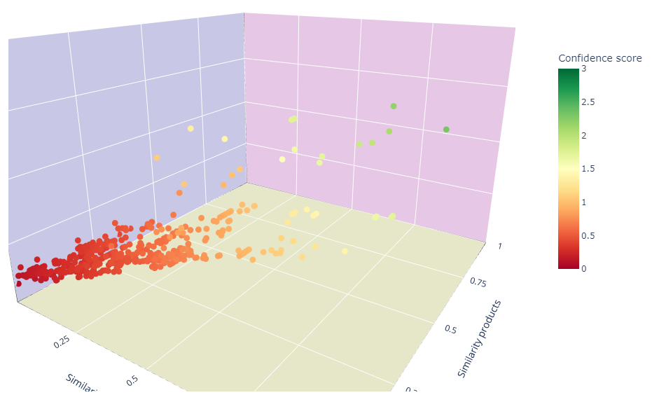
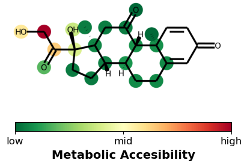
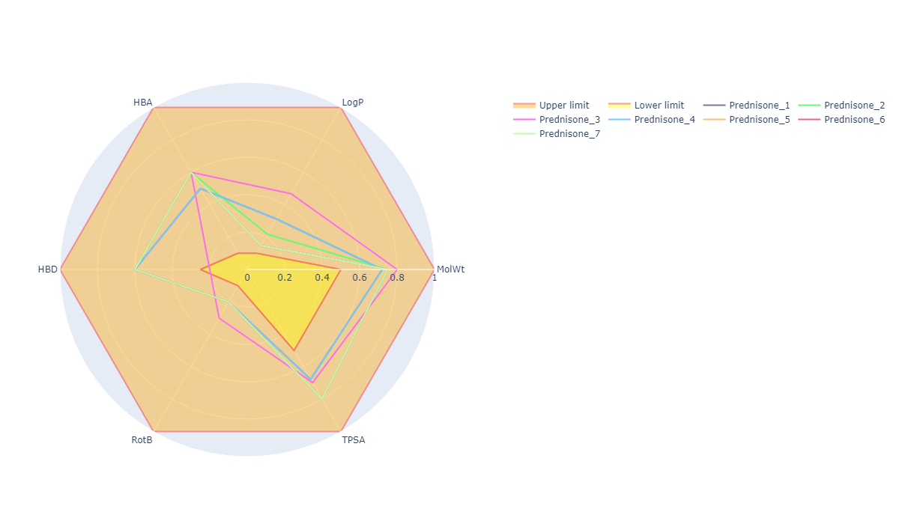
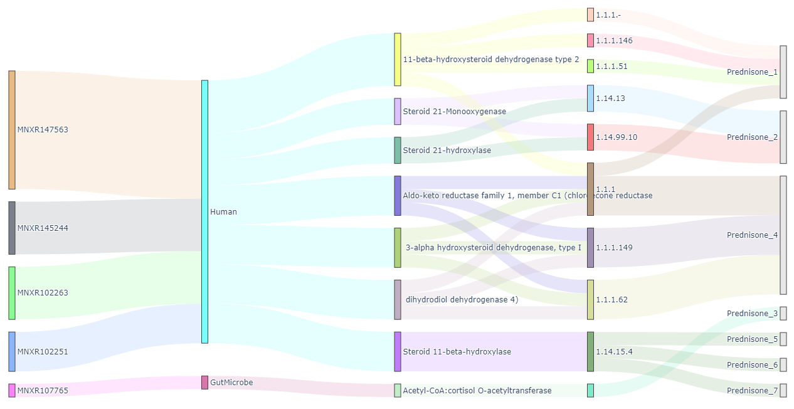

[**Description**](#description) | [**Requirements**](#requirements) | [**Installation**](#installation) | [**Examples**](#examples) | [**Citation**](#citation) | [**License**](#license) | [**Information**](#information) | [**Disclaimer**](#disclaimer)

[](https://zenodo.org/badge/latestdoi/657648349)


## Description

**MicrobeRX is A tool for enzymatic reaction-based metabolite prediction in the gut microbiome.** <br><br>

> The main publication and details about the tool can be found in this publication:

>> [publication here]()

> The python library was developed to be integrated easily with any other bioinformatic or cheminformatic tool.

> This repository contains examples as Jupyter Notbooks showing the capabilities of this library.

Question about usage or troubleshooting? Please leave a comment in the discussion section of this repo

## Requirements

MicrobeRX is reliant on a variety of academic software. The Jupyter Dock.yaml file contains all the tools and dependencies, but the following are some of the most noticeable:

- rdkit
- datamol
- pyopenms
- pubchempy
- pandas
- plotly
- mols2grid
- rxnMapper
- ReactionDecoder

## Installation 

**1. Installing MicrobeRX from PIP:**

```
pip install MicrobeRX
```

**2. GoogleColab:**

> [MicrobeRX Colab](https://shorturl.at/cpqu4)


## Examples

> **Predicition scoring** 
> **Metabolic accesibility** 

> **Molecular descriptors** 
> **Isotopic mass** 
  
> **Relationships** 

## Citation

If you use this software or its results in your research, publication, or project, please cite it as follows:

> MicrobeRX: A tool for enzymatic reaction-based metabolite prediction in the gut microbiome [DOI: 10.5281/zenodo.8207746](https://zenodo.org/record/8207746)

## License
This tool is under GPL-3.0 license, see the LICENSE file for details.

## Information

- This release includes the functionalities to generate reaction rules
- This release includes the functionalities to predict, analyze and visualize metabolites.
- This release NOT includes yet the functionalities to find microorganism and enzymes. Sorry!

## Disclaimer 

This software is still under development and may contain bugs or errors. The developers do not guarantee the accuracy, completeness, or reliability of the software or its results. Use it at your own risk and discretion. The software is provided "as is" without any warranty of any kind, either express or implied, including but not limited to the warranties of merchantability, fitness for a particular purpose, and non-infringement. The developers are not liable for any damages, losses, or costs arising from the use of the software or its results.
